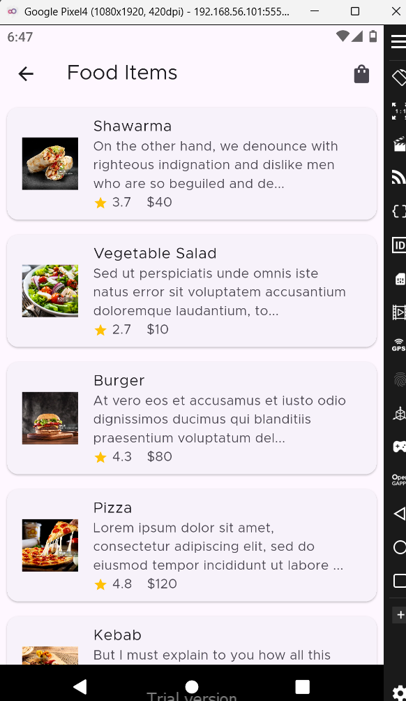

# 🐒 Monkey Meal

**Monkey Meal** is a food delivery mobile application built using **Flutter**.  
It provides a smooth and fast experience for browsing meals and placing food orders with a modern and scalable design.

---

## 📱 Screenshots
| Splash | Login | Home |
|--------|-------|------|
|  |  |  |

| Cart | Profile |
|------|---------|
|  |  |
---

## ✨ Features

- 🍔 Browse meals menu
- 🛒 Shopping cart
- 📦 Order tracking
- 🔐 User authentication
- 📱 Responsive UI
- ⚡ High performance with Flutter

---

## 🛠️ Built With

- **Flutter**
- **Dart**
- **Material Design**

---

## 📂 Project Structure

monkey-meal/
├── android/
├── ios/
├── web/
├── lib/
│ ├── main.dart
│ ├── screens/
│ ├── widgets/
│ ├── models/
│ └── services/
├── test/
├── pubspec.yaml
└── README.md


---

## 🚀 Getting Started

### 1️⃣ Clone the repository
```bash
git clone https://github.com/Ahmedzagzoug1/monkey-meal.git
2️⃣ Navigate to the project directory
bash
cd monkey-meal
3️⃣ Install dependencies
bash
flutter pub get
4️⃣ Run the app
bash
flutter run
📦 Dependencies
## 📦 Dependencies

This project uses the following Flutter packages:

### 🔁 State Management
- **bloc** – Business Logic Component pattern
- **flutter_bloc** – Flutter widgets for Bloc
- **equatable** – Value equality for Bloc states and events

### 🔥 Firebase
- **firebase_auth** – User authentication
- **cloud_firestore** – Cloud Firestore database
- **firebase_storage** – File storage
- **firebase_messaging** – Push notifications (FCM)

### 🖼️ UI & Animations
- **animated_bottom_navigation_bar** – Animated bottom navigation
- **animated_notch_bottom_bar** – Notched animated bottom bar
- **smooth_page_indicator** – Page indicators
- **flutter_screenutil** – Responsive UI for multiple screen sizes
- **flutter_native_splash** – Native splash screen
- **flutter_launcher_icons** – App launcher icons

### 🌐 Network & Images
- **cached_network_image** – Image caching and loading optimization
- **image_picker** – Pick images from camera or gallery

### 🔐 Authentication
- **google_sign_in** – Google authentication support

### 💾 Local Storage
- **shared_preferences** – Persistent local storage

### 🌍 Localization & Utilities
- **intl** – Date, number, and localization formatting
- **uuid** – Generate unique identifiers
